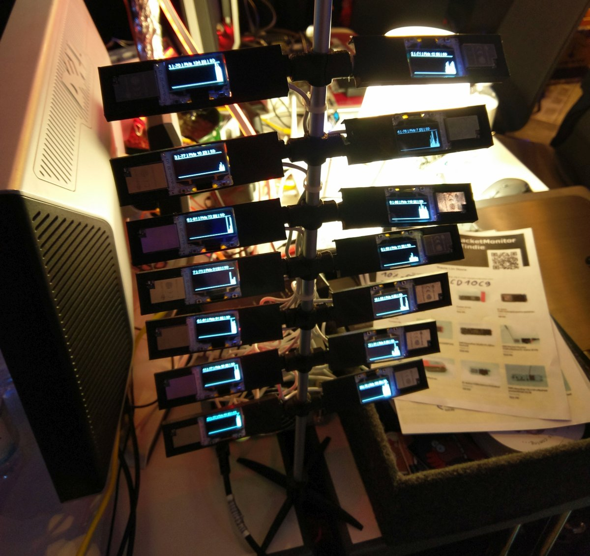
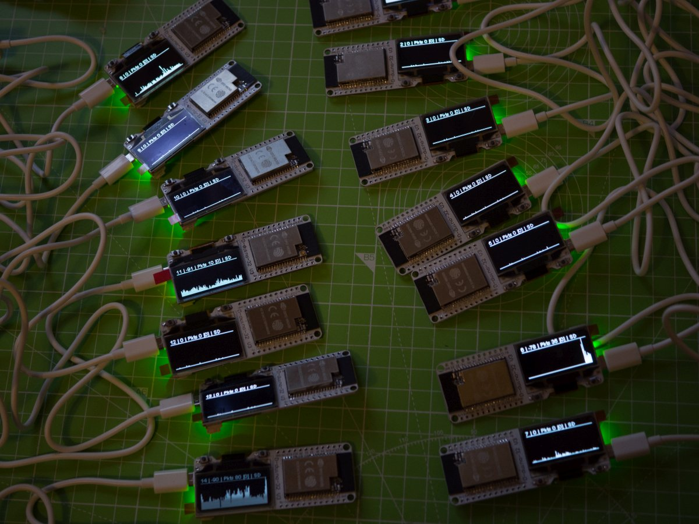
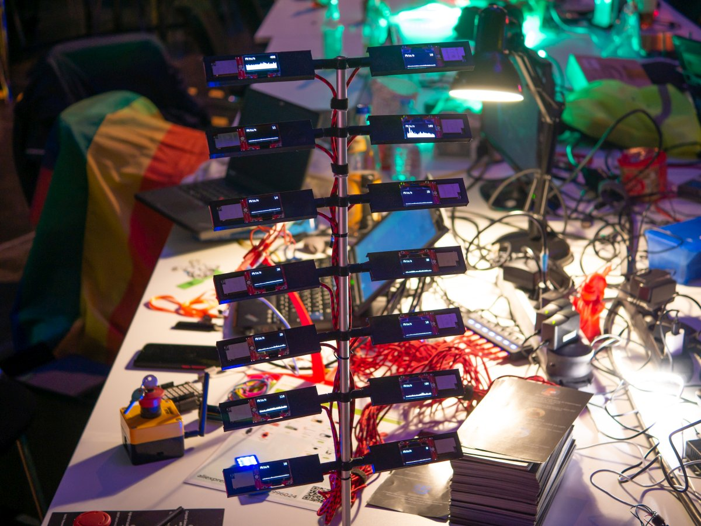
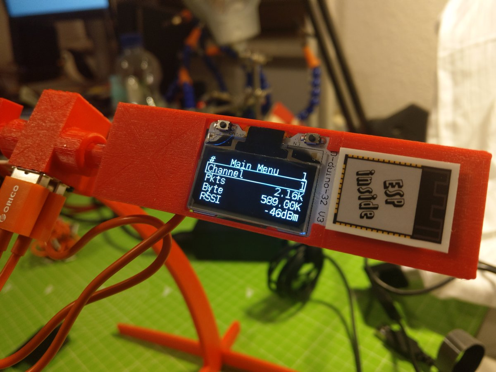

# WiFiSatellite

<b>Monitoring and logging 2.4GHz WiFi traffic</b> 
on all 14 simultaneously  
 🐦 <a href="https://twitter.com/spacehuhn">Twitter</a>
| 📺 <a href="https://www.youtube.com/spacehuhn">YouTube</a>
| 🌍 <a href="https://spacehuhn.com">spacehuhn.com</a> 
 
Support this project and become a patron on <a href="https://patreon.com/spacehuhn">patreon.com/spacehuhn</a>. 
Also available: <a href="https://www.tindie.com/products/Spacehuhn/spacehuhn-stickers/">Stickers</a></b>!

## Video

## Hardware

**DSTIKE D-duino 32 SD**
- [DSTIKE.com 🇨🇳 ](https://dstike.com/)
- [Tindie 🇨🇳 ](https://tindie.com/stores/lspoplove)  
- [AliExpress 🇨🇳 ](https://dstike.aliexpress.com/store/2996024)  

## First Version (rev1)

- [Hackaday Project](https://hackaday.io/project/28831-wifi-satellite-34c3)
- [Video](https://youtu.be/ST_J6VonVic?t=140)
- [3D parts](rev1_2017/3d/)
- [Software](rev1_2017/PacketMonitor32)

## Second Version (rev2) & Mini

- [Hackaday Project](https://hackaday.io/project/162900-new-wifi-satellite-35c3)
- [Video](https://youtu.be/wBNf-mqigTE?t=675)
- [3D parts](rev2_2018/3d)
- [Software](rev2_2018/WiFiSatellite_Firmware)

## License

The software is licensed under the MIT License. See the [license file](LICENSE) for details.  