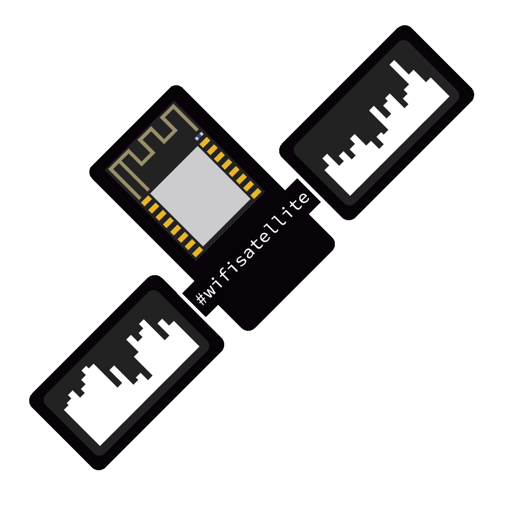

# WiFiSatellite

<b>Monitoring and logging WiFi traffic</b> 
On all 14 different 2.4GHz channels  
 🐦 <a href="https://twitter.com/spacehuhn">Twitter</a>
| 📺 <a href="https://www.youtube.com/spacehuhn">YouTube</a>
| 🌍 <a href="https://spacehuhn.com">spacehuhn.com</a> 
 
Support this project and become a patron on <a href="https://patreon.com/spacehuhn">patreon.com/spacehuhn</a>. 
Also available: <a href="https://www.tindie.com/products/Spacehuhn/spacehuhn-stickers/">Stickers</a></b>!

## License

The software is licensed under the MIT License. See the [license file](LICENSE) for details.  